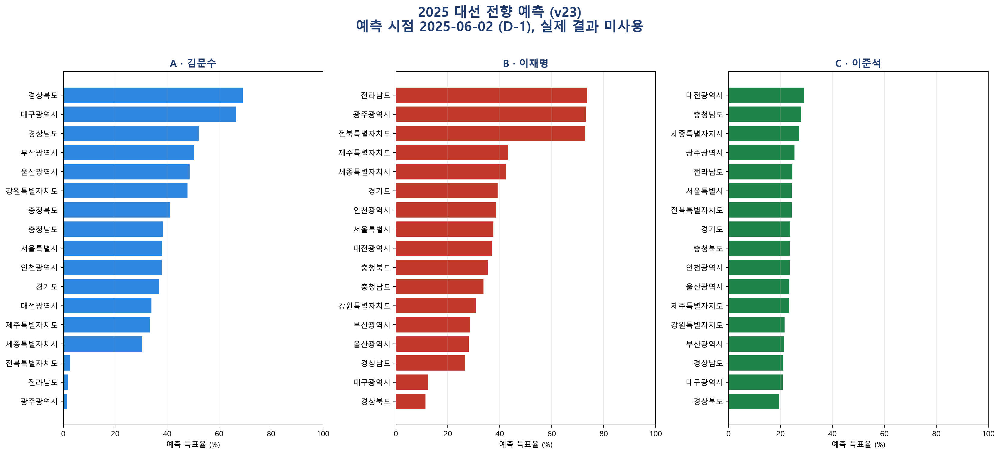

# Election Forecast

[](LICENSE)
[](https://github.com/bamboosalt09-bam/election-forecast/actions/workflows/ci.yml)

재현 가능한 선거 예측 프레임워크와 국회 회의록 분석 파이프라인입니다.

국회 회의록에서 시점별 이슈 부각도를 만들고, 선거 당시 이용 가능했던 지역·정당·후보 자료와 결합합니다. 모든 학습 폴드는 목표 선거를 제외하며 point-in-time(PIT) 감사와 결과 불변성 검사로 미래 정보 혼입을 차단합니다. 한국 대통령선거 예측은 이 인프라의 검증 사례이며, 활성 V24는 2022년까지의 선거만 채점·선택에 사용합니다.

## Quickstart

```bash
python -m pip install -e ".[dev,viz]"
python scripts/compute_forecast_baselines.py
python presidential_issue_engine/make_poster_figures.py
python scripts/audit_public_active_presidential_model_v24.py
python -m pytest -q
```

## 결과 요약

| 지표 | 활성 V24 |
|---|---:|
| 지역 `contest_votes` 가중·선거 동일가중 MAE | **2.7698%p** |
| 전국 후보·선거 동일가중 MAE | **1.0757%p** |
| 승자 적중률 | **80% (4/5)** |
| 채점 선거 | 2002, 2007, 2012, 2017, 2022 |
| 결과 불변성 감사 | 215/215 통과 |


지역 MAE는 후보×지역 오차를 실제 `contest_votes`로 가중한 사후 진단입니다. 전국 MAE 역시 실제 지역 투표량을 집계 가중치로 쓰므로 사전 예측 지표와 구분해야 합니다. 다섯 채점 선거는 모델 개발 표본이며 untouched holdout이 아닙니다.

## 구성요소

### 국회 회의록 분석 파이프라인

- 제15대부터 제22대까지 연결되는 회의록 처리 도구와 출처 매니페스트
- 원본 **4,776,442행** 스캔을 바탕으로 한 이슈·명시 대상·후보 연결 집계
- 문장 방향 분류는 shadow 평가로 격리하고, 활성 엔진은 회의록을 주로 이슈 부각도에 사용
- 선거별 D-1 `available_date` 필터와 입력 SHA-256 기록

2025년 회의록은 시연용 forecast-only 구역에 보관됩니다. D-1 이후 자료와 실제 선거 결과는 학습·모델 선택·성능 비교에 들어가지 않습니다. 자세한 경계는 [2025 forecast-only 문서](docs/PRES_2025_FORECAST_ONLY_ASSEMBLY_CONTEXT_20260810.md)에 설명되어 있습니다.

### 시점 무결성(PIT) · 누수 감사 툴킷

- `presidential_issue_engine/audit_point_in_time.py --deep`: 입력 날짜, fold 범위, 목표 결과 변조 불변성 검사
- `presidential_issue_engine/audit_weight_selection_boundary.py`: 2022년까지의 학습 경계와 격리된 2025 입력 검사
- `scripts/audit_slot_predictor_leakage.py`: 실제 순위로 정해진 슬롯 변수를 활성 모델이 쓰지 않는지 검사
- `scripts/audit_public_active_presidential_model_v24.py`: V23 롤백 경계, V24 포인터·산출물·예측구간·입력 해시 검사

최신 실행 로그는 `outputs/audit_logs/`에 저장합니다. 동결 범위와 매니페스트 해석은 [REPRODUCIBILITY.md](docs/REPRODUCIBILITY.md)를 참조하십시오.

### 대선 예측 엔진

V24는 결과 기반 A/B/C 슬롯을 쓰지 않는 strict chronological nested Ridge 파이프라인입니다. 후보의 사전 체급, 직전 선거까지의 정확 정당 계보, 지역 지형, 국회 회의록 기반 이슈 부각도, 후보 맥락, 철회·단일화 사건, 세대 구성과 거시 지표를 시점 제한 아래 결합합니다. V23의 공통 계수를 유지하면서 실제 3자 투표지, 1%p 채점 하한, 제3후보 계보 상한과 구조적 잔차 계층을 버전 래퍼로 추가합니다.

후처리 계층은 콘크리트·비판적·유동 지지층, 제3후보 경쟁력, 지역 정체성, 정권 심판과 거대 이슈 반응을 분리합니다. 모든 선거에 같은 증거 기반 규칙을 적용하며, 2025 실제 결과는 가중치 선택이나 ablation에 사용하지 않습니다. 전체 사양과 개발표본 한계는 [FINAL_MODEL_V24_20260820.md](docs/FINAL_MODEL_V24_20260820.md)에 있습니다.

## 기준선 비교

| 방법 | 지역 매크로 MAE | 비고 |
|---|---:|---:|
| 활성 V24 | **2.7698%p** | 232개 후보×지역 행 |
| 동결 V23 | 3.3679%p | 199개 후보×지역 행 |
| 직전 대선 동일 bloc 유지 | 13.0115%p | +62.64% 평균 |
| 전국 균일 스윙 | 8.8610%p | +53.13% 평균 |
| 실제 전국 득표율 균일 적용 | 10.1773%p | - |

전국 균일 스윙 기준선에는 목표 선거의 실제 전국 결과를 의도적으로 제공합니다. 따라서 모델에 유리한 설명이 아니라 **기준선에 유리한 oracle 조건**입니다. 선거별 값, skill의 1-sample t-test, 95% 신뢰구간은 `outputs/forecast_baselines/`에서 재현됩니다.

## 2025 전향 시연

```bash
python scripts/run_prospective_forecast.py --version v23
```

이 러너는 동결 V23 코드와 2025-06-02(D-1)까지 공개된 후보 명부·국회 발언 맥락만 사용합니다. 2025 실제 결과를 읽거나 성능지표를 계산하지 않으며, 입력 파일의 SHA-256과 결과정보 미사용 선언을 `run_manifest.json`에 기록합니다. V24는 사람이 승격한 설정 파일이 존재할 때만 실행할 수 있습니다.



## 최고 회고 성능과 활성 버전

기존 17개 보존 버전과 비교할 때 V24의 지역 MAE는 **2.7698%p**, 전국 진단 MAE는 **1.0757%p**입니다. 다만 V24는 V23에서 제외됐던 약한 제3후보를 복원해 채점 패널이 199행에서 232행으로 바뀌었으므로 수치 차이를 순수한 동일표본 개선으로 해석할 수 없습니다.

V17~V20은 지역별로 분리된 정당 표현을 사용했습니다. V21에서 단일 정확 계보 원장으로 통합하면서 지역 회고 MAE가 약 **0.178%p** 악화되었고, 이는 회고 적합도보다 표현 일관성과 모든 지역에 동일한 규칙을 우선한 의도적 교환입니다. 결정 근거는 [V21 계보 통합 기록](docs/ACTIVE_V21_UNIFIED_EXACT_GENEALOGY_20260802.md)에 보존되어 있습니다. V23은 롤백 가능한 동결 선행판이고, V24가 현재 공식 포인터입니다.

## 저장소 구조

| 경로 | 역할 |
|---|---|
| `src/election_forecast/` | 공개 forecast API와 데이터 로더 |
| `presidential_issue_engine/` | 회의록·이슈·지역 지형·nested 평가 엔진 |
| `scripts/` | 수집, 빌드, 평가, 감사, 실행 진입점 |
| `data/raw/` | 날짜와 출처가 있는 입력·공식자료 레지스트리 |
| `data/config/` | 버전별 모델 설정과 활성 포인터 |
| `outputs/active_presidential_nested_v24/` | 읽기 전용 V24 활성 산출물과 시간순 예측구간 |
| `outputs/active_presidential_nested_v23/` | 읽기 전용 V23 롤백 산출물 |
| `outputs/prospective_pres_2025_v23/` | 실제 결과 없이 생성한 D-1 전향 시연 산출물 |
| `docs/` | 설계·감사·승격·재현성 기록 |
| `tests/` | PIT, 누수, 입력 경계, 회귀 테스트 |

## 동결 정책

`outputs/active_presidential_nested_v24/`와 V23 롤백 경계는 읽기 전용입니다. 모델 변경은 새 버전 경로에서 개별 ablation으로 측정하며 활성 포인터는 사람의 검토 없이는 이동하지 않습니다. V24 기준 예측 파일의 SHA-256은 최종화 매니페스트에 기록되며, V23 롤백 파일의 SHA-256 `dbcf596308abf026b35a007b121d13e4bef35755aa4d4a9fe47cc95c1484204b`도 계속 감사합니다.

## 용도 범위

이 저장소는 연구·교육·재현성 검토를 위한 도구입니다. 특정 선거의 결과를 단정하거나 투표 판단을 대신하지 않습니다.

## 라이선스

프로젝트가 작성한 소스 코드와 문서는 [Apache License 2.0](LICENSE)으로 배포됩니다. 데이터셋, 모델 가중치, 제3자 소프트웨어와 외부 자료는 각 원출처의 라이선스·이용조건을 따르며 이 저장소의 라이선스로 재허가되지 않습니다. 범위는 [NOTICE](NOTICE)를 참조하십시오.
