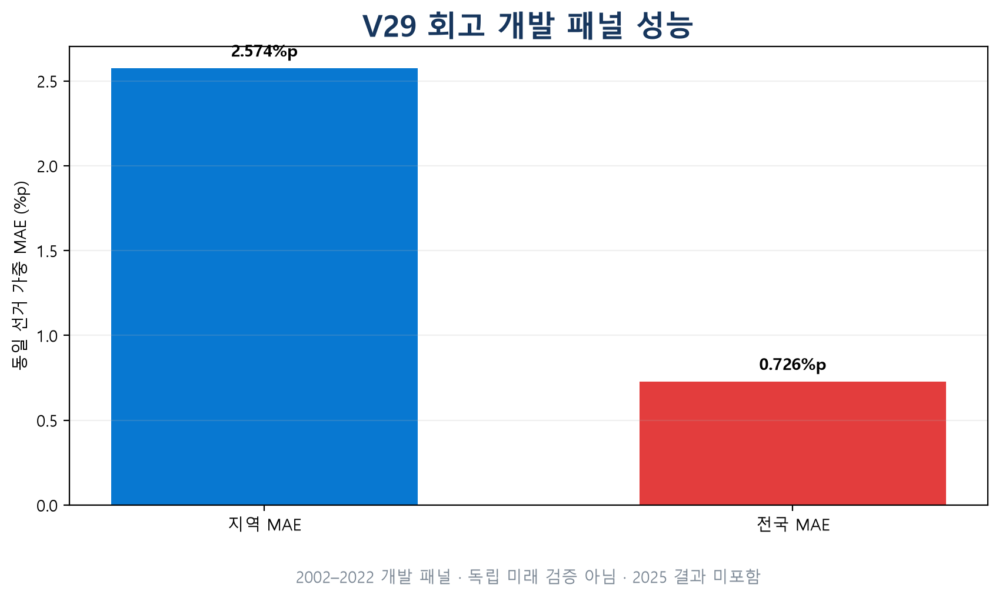
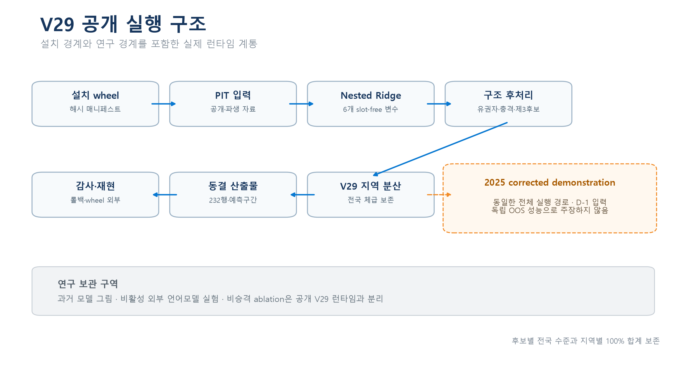
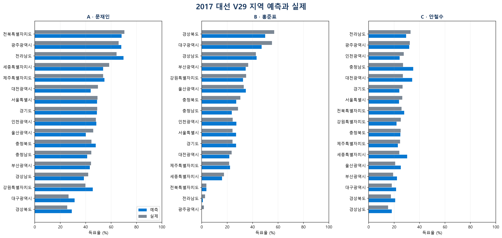
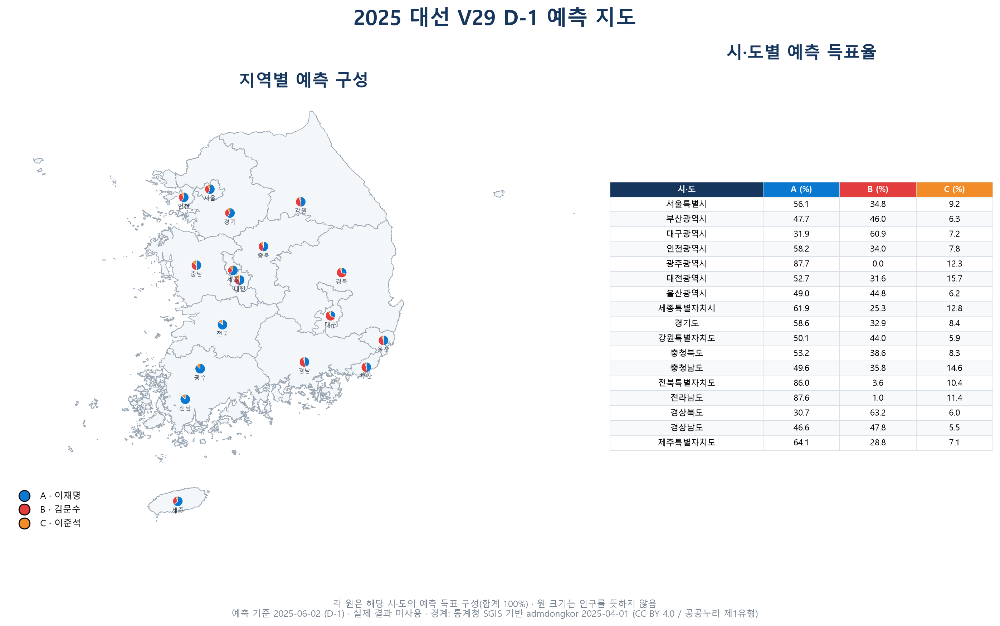

<!-- active-model-version: v29 -->
# Election Forecast

[](LICENSE)
[](https://github.com/bamboosalt09-bam/election-forecast/actions/workflows/ci.yml)

재현 가능한 선거 예측 프레임워크와 국회 회의록 분석 파이프라인입니다.

국회 회의록에서 시점별 이슈 부각도를 만들고, 선거 당시 이용 가능했던 지역·정당·후보 자료와 결합합니다. 모든 학습 폴드는 목표 선거를 제외하며 point-in-time(PIT) 감사와 결과 불변성 검사로 미래 정보 혼입을 차단합니다. 한국 대통령선거 예측은 이 인프라의 검증 사례이며, 활성 V29는 2022년까지의 선거만 채점·선택에 사용합니다. V29는 V28의 외부모델 경계를 그대로 유지한 채, 제3후보가 압축시킨 지역 분산을 각 후보 자신의 전국 체급 주위로 확대하는 변환 하나를 더합니다. 확대 계수가 예측 3위 득표율 그 자체(gain 1.0)여서 채점 패널이 고를 상수가 없고, 전국 체급이 구성적으로 보존되므로 전국 지표는 소수점 아홉 자리까지 움직이지 않습니다. V28은 롤백으로 동결되어 있습니다.

## Quickstart

```bash
python -m pip install .
election-forecast --version
election-forecast show-active-version
election-forecast run-current-presidential --output-dir outputs/reproduction_v29
election-forecast audit-current-presidential
election-forecast verify-current-presidential
```

설치 wheel에는 실제 V29 실행 소스, 공개·파생 입력, V23~V28 롤백 감사
산출물이 해시 매니페스트와 함께 들어갑니다. 따라서 소스 체크아웃이 없는
디렉터리에서도 위 감사와 재현 검사를 실행할 수 있습니다. 개발·시각화까지
필요하면 다음처럼 설치합니다.

```bash
python -m pip install -e ".[dev,viz,reproduce-v29]"
python scripts/compute_forecast_baselines.py
python presidential_issue_engine/make_poster_figures.py
python scripts/audit_public_active_presidential_model_v29.py
python scripts/audit_public_data_rights.py
python scripts/audit_publication_security.py
python -m pytest -q
```

동결 V29의 기준 재산출 환경은 Windows, Python 3.13과 V27에서 이어받은
`requirements-v27.lock`입니다. 일반 설치의 Python 3.11+ 지원과 동결 수치
환경은 구분됩니다.

## 결과 요약

| 지표 | 활성 V29 |
|---|---:|
| 지역 `contest_votes` 가중·선거 동일가중 MAE | **2.5736%p** |
| 전국 후보·선거 동일가중 MAE | **0.7262%p** |
| 승자 적중률 | **80% (4/5)** |
| 채점 선거 | 2002, 2007, 2012, 2017, 2022 |
| 결과 불변성 감사 | 215/215 통과 |







### 폴드별 훈련 깊이

시간순 중첩이므로 첫 채점 선거는 워밍업 하나만으로 예측됩니다. 설계의 목적이지 결함은 아니지만, **선거 동일가중 macro는 훈련 1개짜리 폴드와 5개짜리 폴드를 같은 무게로 평균**합니다.

| 목표 | 훈련 선거 | 최대 VIF | 지역 MAE | 전국 MAE | 승자 | 전국 macro 기여 |
|---|---:|---:|---:|---:|:-:|---:|
| **2002** | **1** | **1.0000** | 2.957 | **2.385** | ✗ | **66%** |
| 2007 | 2 | 1.007 | 3.730 | 0.648 | ✓ | 18% |
| 2012 | 3 | 15.04 | 2.387 | 0.157 | ✓ | 4% |
| 2017 | 4 | 13.84 | 2.607 | 0.095 | ✓ | 3% |
| 2022 | 5 | 11.06 | 1.187 | 0.346 | ✓ | 10% |

전국 macro **0.7262 중 0.4770이 2002 하나**에서 옵니다. 2002를 뺀 네 폴드의 macro는 0.3116입니다. 더 좋은 숫자를 주장하려는 게 아니라, 두 값이 **서로 다른 것을 기술**하므로 앞의 것만 인용하면 한 폴드가 66%라는 사실이 가려지기 때문입니다.

2002는 패널 유일의 승자 오답이기도 합니다. 다만 지역 MAE는 2.957로 중간이고 전국 MAE만 최악인데, 이는 지역 형태는 맞고 **두 거대후보 간 수준이 틀린** 형태입니다. 예측변수 6개를 선거 하나로 적합한 폴드에서 예상되는 양상입니다. 전체 검진은 [2002 진단](docs/DIAGNOSIS_PRES_2002_20260822.md)에 있습니다.

```bash
python scripts/diagnose_fold_training_depth.py --active-dir outputs/active_presidential_nested_v29
```

지역 MAE는 후보×지역 오차를 실제 `contest_votes`로 가중한 사후 진단입니다. 전국 MAE 역시 실제 지역 투표량을 집계 가중치로 쓰므로 사전 예측 지표와 구분해야 합니다. 다섯 채점 선거는 모델 개발 표본이며 untouched holdout이 아닙니다.

### 전국 지표의 상당 부분은 오차 상쇄입니다

전국 지표는 지역 오차를 **부호째 상쇄**시켜 계산하므로, 지역마다 크게 틀려도 오차 방향이 반대면 전국은 정확해 보입니다.

`상쇄율 = 1 − |전국오차| / 지역절대오차`

| 선거 | 상쇄율 | 전국 오차 | 지역 절대 |
|---|---:|---:|---:|
| **2002** | **0.281** | **2.385** | 2.957 |
| 2022 | 0.540 | 0.346 | 1.187 |
| 2007 | 0.819 | 0.648 | **3.730** |
| 2012 | 0.934 | 0.157 | 2.387 |
| 2017 | **0.963** | **0.095** | 2.607 |

전국 수치는 지역이 얼마나 맞았는지만이 아니라 **오차가 얼마나 서로를 지우는지**에도 크게 좌우됩니다. V29에서도 2007은 지역 최악(3.730)인데 81.9%가 상쇄돼 전국은 0.648입니다. 패널 평균 상쇄율은 0.691이고, 상쇄율 대 전국오차는 r = −0.851인 반면 지역정확도 대 전국오차는 r = 0.328입니다.

극단은 홍준표 2017입니다 — 전국 오차 **+0.058%p**, 지역 절대오차 **2.874%p**, 상쇄율 **0.980**. V27의 지역 양극화 보정에 이어 V29의 분산 확대까지 그의 지역 절대오차를 줄였지만(V26 3.377 → V29 2.874), 전국값이 정확해 보이는 데 상쇄가 지배적으로 기여한다는 사실은 그대로입니다.

2002가 패널 최악인 이유도 이것입니다. 지역 오차는 2.957로 중간인데 **상쇄율이 0.281로 최저** — 오차가 보상적이 아니라 계통적입니다. V29에서 2002의 상쇄율이 0.240에서 올라간 것은 개선이 아니라 분모인 지역 절대오차가 커진 결과입니다.

따라서 **전국 0.7262%p를 지역 수준이 맞다는 증거로 읽으면 안 됩니다.** 전체 논의의 출발점은 [오차 상쇄 진단](docs/DIAGNOSIS_ERROR_CANCELLATION_20260822.md)에 있습니다. 위 표는 V29 실측이며, 해당 문서 본문의 상세 수치는 V26 시점의 최초 진단이라 값이 다릅니다.

```bash
python scripts/diagnose_error_cancellation.py --active-dir outputs/active_presidential_nested_v29
```

### 사전(ex-ante) 가중 병기

헤드라인 가중치는 목표 선거의 실제 투표수라 예측 시점에 알 수 없습니다. 예측 당시 이용 가능한 가중치로도 함께 제시합니다.

| 가중 방식 | 전체 5개 선거 | 공통 4개 선거 |
|---|---:|---:|
| `contest_votes` (헤드라인, 사후) | 2.5736 | 2.4779 |
| 직전 선거 투표량 (사전) | 2.6074 | 2.6074 |
| 등가 지역 (사전) | 3.2039 | 3.0494 |

직전 선거 투표량은 첫 선거에 선행 선거가 없어 4개에서만 정의되므로, 세 방식의 직접 비교는 **공통 4개 선거** 열로만 해야 합니다.

공통 네 선거에서 사후 가중이 사는 이득은 약 **0.130%p**입니다(2.4779 대 2.6074). 등가 지역은 3.0494%p로, 큰 지역보다 작은 지역에서 오차가 더 크다는 패턴도 남아 있습니다.

```bash
python scripts/evaluate_ex_ante_weighting.py --active-dir outputs/active_presidential_nested_v29
```

## 구성요소

### 국회 회의록 분석 파이프라인

- 제15대부터 제22대까지 연결되는 회의록 처리 도구와 출처 매니페스트
- 원본 **4,776,442행** 스캔을 바탕으로 한 이슈·명시 대상·후보 연결 집계
- 문장 방향 분류는 shadow 평가로 격리하고, 활성 엔진은 회의록을 주로 이슈 부각도에 사용
- 선거별 D-1 `available_date` 필터와 입력 SHA-256 기록

2025년 회의록은 시연용 forecast-only 구역에 보관됩니다. D-1 이후 자료와 실제 선거 결과는 학습·모델 선택·성능 비교에 들어가지 않습니다. 자세한 경계는 [2025 forecast-only 문서](docs/PRES_2025_FORECAST_ONLY_ASSEMBLY_CONTEXT_20260810.md)에 설명되어 있습니다.

### 시점 무결성(PIT) · 누수 감사 툴킷

- `presidential_issue_engine/audit_point_in_time.py --deep`: 입력 날짜, fold 범위, 목표 결과 변조 불변성 검사
- `presidential_issue_engine/audit_weight_selection_boundary.py`: 2022년까지의 학습 경계와 격리된 2025 입력 검사
- `scripts/audit_slot_predictor_leakage.py`: 실제 순위로 정해진 슬롯 변수를 활성 모델이 쓰지 않는지 검사
- `scripts/audit_public_active_presidential_model_v29.py`: V23~V28 롤백 경계, V29 포인터·산출물·예측구간·신경망 런타임 부재·음수 지분 부재와 잔류 파생 집계표 공개 검사
- `scripts/audit_current_public_surface.py`: 공개 활성 별칭·V29 포인터·내부 V16 기반·패키지 개발 버전의 동기화 검사
- `scripts/audit_version_consistency.py`: 포인터를 단일 기준으로 패키지 버전 4곳·CLI 배너·런타임 로더 유일성·동결 해시 3곳·CI 잡 이름의 버전 부재까지 일치 검사

최신 실행 로그는 `outputs/audit_logs/`에 저장합니다. 동결 범위와 매니페스트 해석은 [REPRODUCIBILITY.md](docs/REPRODUCIBILITY.md)를 참조하십시오.

### 입력 탐색

`scripts/describe_inputs.py`는 모델 코드를 읽지 않고 입력 구조를 답합니다.

```bash
python scripts/describe_inputs.py inventory
python scripts/describe_inputs.py check pres_2025
python scripts/describe_inputs.py sources pres_2025
```

- `inventory`: `data/raw`의 큐레이션 표 54개를 선거 키 보유 여부와 PIT 날짜열 보유 여부로 분류
- `check`: 한 선거가 어느 표에 행이 없는지, 채워야 할 컬럼이 무엇인지, 마감일 이후 행이 있는지. 마감일 위반이 있으면 종료 코드 1이므로 실행 전 게이트로 쓸 수 있습니다
- `sources`: `official_sources` 원본 트리의 수집 행수 대비 PIT 통과 행수. 로더가 자체 필터링하므로 `check`는 이 트리를 위반으로 세지 않습니다

새 선거를 추가할 때는 `check`가 비어 있다고 해서 설정이 잘못된 것은 아닙니다 — 전망 대상은 보통 `data/raw`가 아니라 `scripts/run_prospective_forecast.py`가 실행 시점에 생성하는 컨텍스트 경로로 공급됩니다.

### 대선 예측 엔진

V29는 결과 기반 A/B/C 슬롯을 쓰지 않는 strict chronological nested Ridge 파이프라인입니다. V28의 Ridge 모형·예측변수·투표지 패널·충격 구조·지역 분산층과 외부모델 경계를 모두 유지하고, 제3후보 지수 기반 분산 확대층을 추가합니다. 역사 후처리가 소비하는 동결 후보×이슈 집계표는 별도로 공개합니다. 후보별 전국 체급과 지역별 100% 합계는 바꾸지 않습니다.

현재 실행 구조는 [V29 architecture](docs/ARCHITECTURE.md), 안전한 수정·재사용 절차는 [CONTRIBUTING](CONTRIBUTING.md)에 정리되어 있습니다.

후처리 계층은 콘크리트·비판적·유동 지지층, 제3후보 경쟁력, 지역 정체성, 정권 심판과 거대 이슈 반응을 분리합니다. 모든 선거에 같은 증거 기반 규칙을 적용하며, 2025 실제 결과는 가중치 선택이나 ablation에 사용하지 않습니다. 전체 사양과 개발표본 한계는 [FINAL_MODEL_V29_20260823.md](docs/FINAL_MODEL_V29_20260823.md)에 있습니다.

#### 각 구조 규칙이 서 있는 관측 수

구조 층은 조건부로 발동하므로, 채점 선거가 다섯이라는 사실이 각 규칙의 증거가 다섯이라는 뜻은 아닙니다. 실제로 발동하는 선거 수가 그 규칙이 가진 증거의 전부입니다.

| 구조 층 | 채점 발동 선거 | 개수 |
|---|---|---:|
| `strong_incumbent_veto` | 2007, 2017 | 2 |
| `third_candidate_lineage_ceiling` | 2002 | **1** |
| `weak_same_lane_refusal` | 2002, 2022 | 2 |
| 직접 거대 이슈 귀속 | 2012, 2017 | 2 |

**세 층이 모두 발동하는 채점 선거는 없고**, 두 층이 겹치는 선거는 2002 하나뿐입니다. 2025는 셋 다 발동합니다. 따라서 세 층의 상호작용은 이 패널로 검증할 수 없으며, 순서 순열·고립 ablation 결과와 그 한계는 [후처리 ablation 기록](docs/EXPERIMENT_POSTPROCESS_ABLATION_20260822.md)에 있습니다.

```bash
python scripts/evaluate_postprocess_ablation.py
```

## 기준선 비교

| 방법 | 지역 매크로 MAE | 비고 |
|---|---:|---:|
| 활성 V29 | **2.5736%p** | 232개 후보×지역 행 |
| 동결 V26 | 2.7122%p | 232개 후보×지역 행 |
| 동결 V25 | 2.7739%p | 232개 후보×지역 행 |
| 동결 V24 | 2.7698%p | 232개 후보×지역 행 |
| 동결 V23 | 3.3679%p | 199개 후보×지역 행 |
| 직전 대선 동일 bloc 유지 | 13.0115%p | +62.64% 평균 |
| 전국 균일 스윙 | 8.8610%p | +53.13% 평균 |
| 실제 전국 득표율 균일 적용 | 10.1773%p | - |

전국 균일 스윙 기준선에는 목표 선거의 실제 전국 결과를 의도적으로 제공합니다. 따라서 모델에 유리한 설명이 아니라 **기준선에 유리한 oracle 조건**입니다. 선거별 값, skill의 1-sample t-test, 95% 신뢰구간은 `outputs/forecast_baselines/`에서 재현됩니다.

## 2025 전향 시연

```bash
python scripts/run_prospective_forecast_v29.py
```

이 러너는 V26 실행 계보, V27에서 계승한 지역 양극화층, V28의 외부모델 경계, 그리고 V29의 제3후보 분산 확대층을 거쳐 2025-06-02(D-1)까지 공개된 후보 명부·국회 발언 맥락만 사용합니다. 외부모델 파생 overlay와 2025 실제 결과를 읽지 않고 성능지표도 계산하지 않습니다. 보존 가중치는 2022 지역 투표량이며 입력 SHA-256과 결과정보 미사용 선언을 `run_manifest.json`에 기록합니다.

산출물은 `outputs/prospective_pres_2025_v29/`이며, 발행돼 있던 V28 산출물을 대체합니다. **그 V28 산출물은 V28 경계가 프로세스 전체로 강제되기 *이전*에 만들어져, V28이 제거했다고 문서화한 시드 입력을 쓰고 있었습니다.** 재생성으로 달라진 폭은 원인별로 나뉩니다:

| 변화 원인 | 지역 최대 | 지역 평균 | 전국 최대 |
| --- | ---: | ---: | ---: |
| 경계를 실제로 지킨 것 | 0.0359%p | 0.0103%p | 0.006484%p |
| V29 분산 확대 | 2.6703%p | 0.6970%p | **0** |

승자와 후보 순위는 그대로입니다. 전국 이동은 전부 경계 쪽이고 그 크기가 0.0065%p에 그친다는 점은, 산출물이 경계와 어긋나 있었음에도 V28의 제거 주장 자체는 실질적으로 참이었다는 증거이기도 합니다. 2025의 확대 계수는 실현 가능 상한에 걸려 `1.086615`에서 `1.081279`로 제한됩니다.

재현은 `scripts/verify_v29_prospective_reproduction.py`가 CI(`prospective-reproduction`)에서 매번 수행합니다. 공개 트리만으로 재현되며, 그 경계와 회의록으로부터의 재계산 절차는 [2025 입력 안내](docs/PRES_2025_INPUT_GUIDE.md)에 있습니다.



지도 위 원형은 각 시·도의 후보별 예측 구성으로 합계가 100%이며, 원
크기는 인구나 투표수를 뜻하지 않습니다. 경계는 통계청 SGIS 기반
`admdongkor` 2025-04-01 자료를 사용하고 다운로드 SHA-256을 고정합니다.
출처·라이선스·재현 조건은 [시각화 데이터 문서](docs/VISUALIZATION_DATA.md)에
있습니다. 2025 그림은 실제 결과를 포함하지 않는 교정된 시연입니다.

### 2025 사후 평가

선거 후 공개된 중앙선거관리위원회 개표결과를 동결 V27 D-1 예측에
연결했습니다. 이 결과는 평가에만 사용하며 모델 적합·선택·조정에는
들어가지 않습니다. V27이 A/B/C 세 후보 합계 100%를 예측하므로 실제
결과도 같은 세 후보 범위로 정규화한 값이 헤드라인입니다.

| 2025 사후 점 오차 | V27 |
|---|---:|
| 지역 실제 A/B/C 유효표 가중 MAE | **4.6281%p** |
| 지역 동일가중 MAE | **4.6968%p** |
| 동결 전국 예측 후보 MAE | **4.0539%p** |

| 후보 | 동결 전국 예측 | 실제 A/B/C 정규화 | 오차 |
|---|---:|---:|---:|
| 이재명 | 55.81% | 49.96% | +5.85%p |
| 김문수 | 35.52% | 41.61% | -6.08%p |
| 이준석 | 8.66% | 8.43% | +0.23%p |

재현 명령은 `python scripts/evaluate_pres_2025_v27.py`입니다. 공식 원본,
범위, 계산식과 해시는 [2025 V27 사후 평가](docs/PRES_2025_V27_POST_ELECTION_EVALUATION.md)에
기록했습니다.

### 이 경로를 out-of-sample 예측으로 인용하지 마십시오

2026-08-21에 `mega_issue_terms.csv`의 어휘 공백을 메웠습니다. 이 표는 2017 헌정위기 어휘를 9개 보유한 반면 2025는 0개였고, 그 상태로는 위기 강도를 빈 계측기로 재고 있었습니다. 등록한 8개(비상계엄·계엄·탄핵소추·윤석열 탄핵·탄핵·파면·권한대행·내란)는 모두 D-1 이전의 문서화된 사실이며 채점 패널은 비트 동일하게 유지됩니다.

그러나 이 한 번의 자료 보정이 전망을 **21%p 이동**시켰습니다.

| | 김문수 | 이재명 | 이준석 |
|---|---:|---:|---:|
| 어휘 등록 전 | 47.68 | 46.72 | 5.60 |
| 현재 | 35.52 | 55.81 | 8.66 |

위기 클래스가 인식되는 순간 임계값 연쇄가 한꺼번에 넘어가기 때문입니다(강도 0.75→2.00, 지배 활성화 0.168→1.00, `strong_incumbent_veto` 미발동→17개 지역 전부). 그리고 조사를 시작한 계기 자체가 2025 산출이 이상해 보인다는 관찰이었으므로, 개별 파라미터를 결과에 맞춘 적은 없어도 **탐색 방향은 결과의 영향을 받았습니다**.

따라서 이 경로는 out-of-sample 예측이 아니라 **교정된 시연**입니다. 전체 연쇄 분해와 유보 사항은 [HANDOFF_CURRENT_STATE.md](docs/HANDOFF_CURRENT_STATE.md)에 기록되어 있습니다.

## 최고 회고 성능과 활성 버전

활성 V29의 지역 MAE는 **2.5736%p**, 전국 진단 MAE는 **0.7262%p**입니다. 지역은 V28의 `2.6384%p`에서 개선됐고 전국은 아홉 자리까지 동일한데, 이는 결과가 아니라 변환의 성질입니다 — 후보 체급이 모든 지역에서 합 1이므로 균일 확대는 지역 합을 1로 남기고 재정규화가 항등이 됩니다. 실측 최대 체급 이동은 `5.6e-15%p`입니다. 두 값 모두 개발표본 진단이며 untouched holdout 성능이 아닙니다.

V17~V20은 지역별로 분리된 정당 표현을 사용했습니다. V21에서 단일 정확 계보 원장으로 통합하면서 지역 회고 MAE가 약 **0.178%p** 악화되었고, 이는 회고 적합도보다 표현 일관성과 모든 지역에 동일한 규칙을 우선한 의도적 교환입니다. V23~V27은 롤백 가능한 동결 선행판이고, V28이 현재 공식 포인터입니다.

### V26이 바꾼 것

거대 이슈 강도는 `{0.50, 0.75, 1.00, 2.00}` 네 값만 도달 가능하고 활성화는 `(강도−1)`을 0~1로 자르므로, 직접 충격은 **완전 무력이거나 완전 포화** 둘 중 하나였습니다. V26은 그 사이를 분류기 자신의 게이트 근접도로 채우고, 전망 경로에만 있던 이벤트-클래스 정렬을 채점 경로에도 적용합니다. 2×2로 두 변경을 분리해 측정했습니다.

| 변형 | 지역 macro | 전국 macro |
|---|---:|---:|
| V25 기준선 | 3.4403 | 0.9896 |
| 사다리 단독 | 5.0037 | 3.2278 |
| 정렬 단독 | 3.4403 | 0.9896 |
| **둘 다 (V26)** | **3.4214** | **0.7210** |

정렬 단독은 기준선과 자릿수까지 동일하고 사다리 단독은 파국이며, **둘이 함께일 때만** 개선됩니다. 강도 게이트 1.00이 채점 패널에서 정렬의 일을 대신해왔기 때문입니다. 새 상수는 없고 — 천장·바닥·게이트가 모두 기존 값입니다 — 2017은 이미 천장이라 구조적으로 보존됩니다.

**남는 한계**: 패널 최악인 2002(−3.512%p)는 전혀 움직이지 않습니다. 강도가 0.6837로 여전히 활성화 게이트 아래라 직접 메가 경로가 그곳에서는 무력합니다. 이미 잘 맞던 선거만 좋아지고 이상치가 그대로인 패턴이므로 다음 조사 지점입니다. 그리고 조합 선택은 이를 측정한 것과 같은 다섯 결과로 이뤄졌습니다.

측정 기록은 [V25 강도 사다리 실험](docs/EXPERIMENT_V25_INTENSITY_LADDER_20260822.md), 승격 기록은 [FINAL_MODEL_V26_20260822.md](docs/FINAL_MODEL_V26_20260822.md)에 있습니다.

```bash
python scripts/evaluate_v25_intensity_ladder.py
```

### V29가 바꾼 것

예측 지역 분산은 2002·2012·2022에서 실현 분산과 맞고, 제3후보가 큰 2007과 2017에서만 부족합니다. 그 두 선거에서만 실현값의 예측값 회귀 기울기가 1을 넘고(이회창 2007은 2에 가깝습니다) 나머지는 1입니다. 정규화 추정량이 마땅히 가지는 축소가 아니라 **보정 격차**입니다.

V29는 각 후보의 지역 편차를 그 후보 자신의 득표가중 전국 체급 주위로 `1 + 예측 3위 득표율`배 확대하고 지역별로 재정규화합니다. 지수가 곧 보정 크기이므로 어디에 개입할지 따로 정하는 지표가 필요 없습니다 — 2012는 3위 득표율이 정확히 0이라 계수 `1.0000`, 한 톨도 바뀌지 않습니다.

| 선거 | 3위 득표율 | 적용 계수 | 지역 MAE V28 → V29 |
| --- | ---: | ---: | ---: |
| pres_2002 | 0.0445 | 1.0445 | 2.795 → 2.957 |
| pres_2007 | 0.1646 | 1.1646 | 4.044 → **3.730** |
| pres_2012 | **0.0000** | **1.0000** | 2.387 → **2.387** |
| pres_2017 | 0.2461 | **1.1474** | 2.796 → **2.607** |
| pres_2022 | 0.0282 | 1.0282 | 1.171 → 1.187 |

2017은 명목 계수 1.2461에서 홍준표의 광주·전남 예측이 음수로 내려가 실현 가능한 최대치에서 멈춥니다. 이 상한은 후보별이 아니라 선거별입니다 — 후보마다 계수가 다르면 지역 합이 1에서 벗어나 재정규화가 체급을 움직이고, 그게 바로 상한이 막으려던 실패입니다. 두 방식 다 측정했고 후보별은 2017에서 `0.124%p`, 균일은 `5.6e-15`를 남깁니다.

**gain은 적합하지 않았습니다.** 스윕에서 0.50이 지역 `2.555129%p`로 승격값 `2.573607%p`보다 좋습니다. 채택하지 않은 이유는 하나입니다 — 0.50은 채점 대상인 그 다섯 결과에서 쓸어서 고른 상수이고, 그 이점은 그것을 찾는 데 쓴 선택 자유도보다 작습니다. gain 1.0에서는 계수가 예측 3위 득표율 그 자체라 고를 상수가 없습니다. 전국 지표는 스윕 전 구간에서 평평하므로 이 선택이 그쪽에서 치르는 비용은 없습니다.

이 보정이 승격되지 않고 남아 있던 이유도 기록해 둡니다. 원래 실험의 결론은 *"네 기법 모두 전국 지표를 악화시킨다"* 였는데, **V26에서 측정된 뒤 V27·V28 승격 후 재측정된 적이 없었고**, 게다가 그 악화는 평가 하네스가 따로 들고 있던 변환 사본이 음수를 클리핑해 표 질량을 주입한 결과였습니다. 두 결함이 서로를 가리고 있었습니다. 자세한 내용은 [V29 실험 기록](docs/EXPERIMENT_V29_THIRD_SHARE_DISPERSION_20260823.md)에 있습니다.

**2025 시연을 재생성했습니다.** 2025 예측 경로는 V28 경계가 프로세스 전체로 강제된 이후 실행 불가 상태였고, 발행돼 있던 산출물은 그 강제 *이전*에 만들어져 **V28이 제거했다고 문서화한 시드 입력을 쓰고 있었습니다.** 가드의 비교 기준을 같은 런타임에서 만든 것으로 바꿔 고쳤습니다. 승자와 순위는 그대로이고, 원인별 변화폭은 [2025 전향 시연](#2025-전향-시연)에, 전체 경위는 [2025 경로 진단](docs/DIAGNOSIS_PROSPECTIVE_2025_PATH_20260823.md)에 있습니다.

### V28이 바꾼 것

V28은 외부 오픈웨이트 언어모델의 추론·가중치·문장 코퍼스와 `assembly_issue_character_overlay.csv`를 직접 사용하지 않으며, 자동 mega seed 2종도 배포와 실행 경로에서 제외합니다. 최종 감사에서는 레거시 평가 모듈이 overlay CSV를 별도로 직접 읽는 경로와 로컬 `.env` 의존성을 발견해 프로세스 전체 차단으로 고쳤습니다. 이 실제 제거로 지역 MAE는 V27의 `2.6139%p`에서 V28의 `2.6384%p`로 소폭 변했고 승자 정확도는 `0.8`로 유지됐습니다. 반면 후단의 동결 `candidate_issue_profile.csv`까지 제거한 재검사에서는 지역 MAE가 `4.9359%p`, 승자 정확도가 `0.6`으로 악화되어 이 집계표는 유지하고 파생 이력을 공개합니다. 검증 기록은 [외부모델 overlay 제거 실험](docs/EXPERIMENT_REMOVE_EXTERNAL_MODEL_OVERLAY_20260822.md)에 있습니다.

### V27이 바꾼 것

V27은 정당 지역 prior를 득표 하한으로 강제하지 않습니다. 현재 예측의 지역 서열을 유지하면서, `recent_bloc_base`보다 줄어든 지역 logit 분산 중 `core_voting_mass × direct_party_reliability`만큼만 복원합니다. 적용 뒤 후보별 전국 체급과 지역별 100% 합계를 다시 맞춥니다.

자연 강도 1.0에서 지역 MAE는 2.7122→2.6139%p로 개선되고 전국 MAE와 당선자 적중은 유지됐습니다. 개발패널 최적값 3.0은 채택하지 않았습니다. 실험과 승격 근거는 [지역 양극화 실험](docs/EXPERIMENT_CORE_WEIGHTED_REGIONAL_POLARIZATION_20260822.md)과 [V27 최종 기록](docs/FINAL_MODEL_V27_20260822.md)에 있습니다.

## 저장소 구조

| 경로 | 역할 |
|---|---|
| `src/election_forecast/` | 공개 API, CLI와 검증된 V29 패키지 런타임 로더 |
| `presidential_issue_engine/` | 회의록·이슈·지역 지형·nested 평가 엔진 |
| `scripts/` | 수집, 빌드, 평가, 감사, 실행 진입점 |
| `data/raw/` | 날짜와 출처가 있는 입력·공식자료 레지스트리 |
| `data/config/` | 버전별 모델 설정과 활성 포인터 |
| `data/config/active_presidential_model_v16.json` | 후대 버전 실행 계보용 동결 V16 내부 기반 설정 |
| `outputs/active_presidential_nested_v29/` | 읽기 전용 V29 활성 산출물과 시간순 예측구간 |
| `outputs/automatic_controls_v26/` | V26 등급화 거대 이슈 강도 제어 |
| `outputs/active_presidential_nested_v26/` | 읽기 전용 V26 롤백 산출물 |
| `outputs/active_presidential_nested_v25/` | 읽기 전용 V25 롤백 산출물 |
| `outputs/active_presidential_nested_v24/` | 읽기 전용 V24 롤백 산출물 |
| `outputs/active_presidential_nested_v23/` | 읽기 전용 V23 롤백 산출물 |
| `outputs/prospective_pres_2025_v29/` | 실제 결과 없이 생성한 V29 D-1 시연 산출물 |
| `outputs/external_model_free_v25_baseline/` | 2025 하네스가 과거를 바꾸지 않았음을 검증하는 경계 내 V25 기준선 |
| `research/` | 활성 패키지에서 제외한 구식 시각화와 비승격 연구 기록 |
| `docs/` | 설계·감사·승격·재현성 기록 |
| `tests/` | PIT, 누수, 입력 경계, 회귀 테스트 |

공개 저장소의 연구 이력과 설치 배포물의 경계는 [저장소·배포 경계](docs/REPOSITORY_BOUNDARIES.md)에 고정합니다. wheel과 sdist에는 현재 V29 실행·감사에 필요한 코드·입력·공개 문서만 들어갑니다. 외부모델 가중치·문장 코퍼스·직접 overlay·구형 시연·비승격 실험 산출물은 제외하며, 필요한 동결 후보×이슈 집계표 1개만 파생 이력과 함께 포함합니다.

정식 활성 포인터는 `data/config/current_presidential_model.json`입니다.
`active_presidential_model.json`은 같은 내용을 제공하는 공개 호환 별칭이며,
이름 없는 내부 기반 러너는 명시적으로 `active_presidential_model_v16.json`을
사용합니다. 따라서 구형 기반 설정이 현재 버전처럼 노출되지 않습니다.

## 동결 정책

`outputs/active_presidential_nested_v29/`와 V28~V23 롤백 경계는 읽기 전용입니다. V29 예측 SHA-256은 `fed959cdba1e127f91c2ab640a378d1f44a4a3e79b4c4a76893cf8d7c6153904`, V28 롤백은 `23d6efd825244caa1f7b06b84e94cf581f00c6184aeb80769d8bb3d4c2a19fba`, V27 롤백은 `f40775599dde107abc6cf2312c648ad9c780f33c7a0adc4ccf3d74fd5049c55b`, V26 롤백은 `9b66b813f97c3c2804a178ebb5b9104fa4a58553c75812f75affbb3b17773dd3`, V23 롤백은 `dbcf596308abf026b35a007b121d13e4bef35755aa4d4a9fe47cc95c1484204b`입니다.

## 용도 범위

이 저장소는 연구·교육·재현성 검토를 위한 도구입니다. 특정 선거의 결과를 단정하거나 투표 판단을 대신하지 않습니다.

## 라이선스

프로젝트가 작성한 소스 코드와 문서는 [Apache License 2.0](LICENSE)으로 배포됩니다. 데이터셋, 모델 가중치, 제3자 소프트웨어와 외부 자료는 각 원출처의 라이선스·이용조건을 따르며 이 저장소의 라이선스로 재허가되지 않습니다. 범위는 [NOTICE](NOTICE)를 참조하십시오.

입력 계열별 출처와 재배포 판정은 [데이터 출처·재배포 원장](docs/DATA_PROVENANCE_AND_REDISTRIBUTION.md)과 [기계 판독 원장](docs/PUBLIC_DATA_SOURCES.json)을 참조하십시오. 권리가 불명확한 원본, 전체 회의록, API 캐시와 로컬 KOSPI 일별 내역은 Git과 설치 패키지에서 제외됩니다. V29는 재현에 필요한 D-1 선거×슬롯 KOSPI 집계 15행만 출처와 함께 포함합니다. 대회 규정 대응표, SBOM과 AI 명세는 각각 [규정 대응표](docs/COMPETITION_COMPLIANCE_2026.md), [SBOM](docs/SBOM.md), [AI 명세](docs/AI_MODEL_SPEC.md)에 있습니다.
