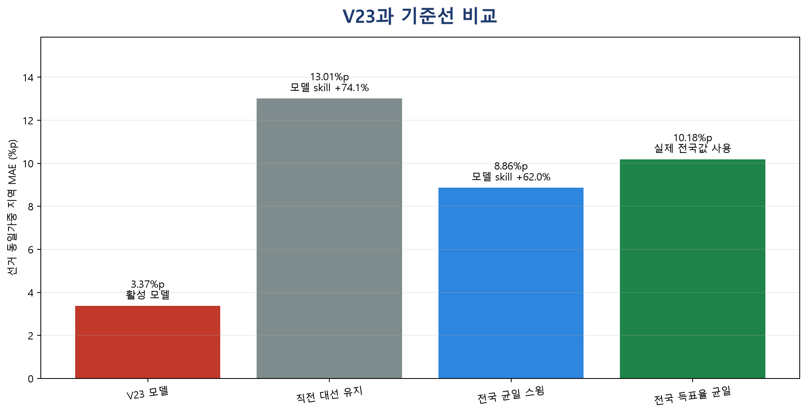
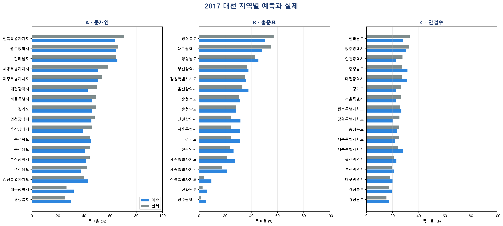
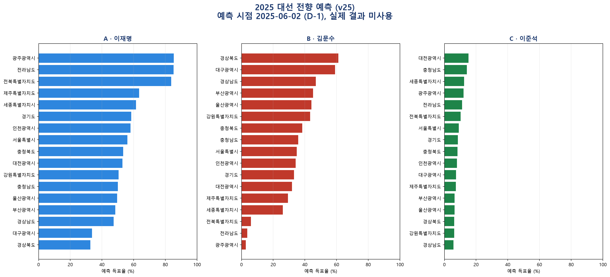

# Election Forecast

[](LICENSE)
[](https://github.com/bamboosalt09-bam/election-forecast/actions/workflows/ci.yml)

재현 가능한 선거 예측 프레임워크와 국회 회의록 분석 파이프라인입니다.

국회 회의록에서 시점별 이슈 부각도를 만들고, 선거 당시 이용 가능했던 지역·정당·후보 자료와 결합합니다. 모든 학습 폴드는 목표 선거를 제외하며 point-in-time(PIT) 감사와 결과 불변성 검사로 미래 정보 혼입을 차단합니다. 한국 대통령선거 예측은 이 인프라의 검증 사례이며, 활성 V26은 2022년까지의 선거만 채점·선택에 사용합니다.

## Quickstart

```bash
python -m pip install -e ".[dev,viz]"
python scripts/compute_forecast_baselines.py
python presidential_issue_engine/make_poster_figures.py
python scripts/audit_public_active_presidential_model_v26.py
python -m pytest -q
```

## 결과 요약

| 지표 | 활성 V26 |
|---|---:|
| 지역 `contest_votes` 가중·선거 동일가중 MAE | **2.7122%p** |
| 전국 후보·선거 동일가중 MAE | **0.7210%p** |
| 승자 적중률 | **80% (4/5)** |
| 채점 선거 | 2002, 2007, 2012, 2017, 2022 |
| 결과 불변성 감사 | 215/215 통과 |





지역 MAE는 후보×지역 오차를 실제 `contest_votes`로 가중한 사후 진단입니다. 전국 MAE 역시 실제 지역 투표량을 집계 가중치로 쓰므로 사전 예측 지표와 구분해야 합니다. 다섯 채점 선거는 모델 개발 표본이며 untouched holdout이 아닙니다.

### 사전(ex-ante) 가중 병기

헤드라인 가중치는 목표 선거의 실제 투표수라 예측 시점에 알 수 없습니다. 예측 당시 이용 가능한 가중치로도 함께 제시합니다.

| 가중 방식 | 전체 5개 선거 | 공통 4개 선거 |
|---|---:|---:|
| `contest_votes` (헤드라인, 사후) | 2.7122 | 2.7023 |
| 직전 선거 투표량 (사전) | 2.8510 | 2.8510 |
| 등가 지역 (사전) | 3.4214 | 3.3844 |

직전 선거 투표량은 첫 선거에 선행 선거가 없어 4개에서만 정의되므로, 세 방식의 직접 비교는 **공통 4개 선거** 열로만 해야 합니다.

읽을 점 두 가지입니다. 헤드라인의 사후 가중이 **사고 있는 이득은 0.15%p뿐**이고(2.7023 대 2.8510), 지역 투표량 구조가 선거 간에 안정적이라는 뜻입니다. 반면 등가 지역이 0.68%p 나쁜 것은 모델이 **큰 지역에서 더 잘 맞고 작은 지역에서 더 못 맞는다**는 실제 패턴입니다.

```bash
python scripts/evaluate_ex_ante_weighting.py
```

## 구성요소

### 국회 회의록 분석 파이프라인

- 제15대부터 제22대까지 연결되는 회의록 처리 도구와 출처 매니페스트
- 원본 **4,776,442행** 스캔을 바탕으로 한 이슈·명시 대상·후보 연결 집계
- 문장 방향 분류는 shadow 평가로 격리하고, 활성 엔진은 회의록을 주로 이슈 부각도에 사용
- 선거별 D-1 `available_date` 필터와 입력 SHA-256 기록

2025년 회의록은 시연용 forecast-only 구역에 보관됩니다. D-1 이후 자료와 실제 선거 결과는 학습·모델 선택·성능 비교에 들어가지 않습니다. 자세한 경계는 [2025 forecast-only 문서](docs/PRES_2025_FORECAST_ONLY_ASSEMBLY_CONTEXT_20260810.md)에 설명되어 있습니다.

### 시점 무결성(PIT) · 누수 감사 툴킷

- `presidential_issue_engine/audit_point_in_time.py --deep`: 입력 날짜, fold 범위, 목표 결과 변조 불변성 검사
- `presidential_issue_engine/audit_weight_selection_boundary.py`: 2022년까지의 학습 경계와 격리된 2025 입력 검사
- `scripts/audit_slot_predictor_leakage.py`: 실제 순위로 정해진 슬롯 변수를 활성 모델이 쓰지 않는지 검사
- `scripts/audit_public_active_presidential_model_v26.py`: V23·V24·V25 롤백 경계, V26 포인터·산출물·예측구간·입력 해시·등급화 강도 단측성 검사

최신 실행 로그는 `outputs/audit_logs/`에 저장합니다. 동결 범위와 매니페스트 해석은 [REPRODUCIBILITY.md](docs/REPRODUCIBILITY.md)를 참조하십시오.

### 입력 탐색

`scripts/describe_inputs.py`는 모델 코드를 읽지 않고 입력 구조를 답합니다.

```bash
python scripts/describe_inputs.py inventory
python scripts/describe_inputs.py check pres_2025
python scripts/describe_inputs.py sources pres_2025
```

- `inventory`: `data/raw`의 큐레이션 표 54개를 선거 키 보유 여부와 PIT 날짜열 보유 여부로 분류
- `check`: 한 선거가 어느 표에 행이 없는지, 채워야 할 컬럼이 무엇인지, 마감일 이후 행이 있는지. 마감일 위반이 있으면 종료 코드 1이므로 실행 전 게이트로 쓸 수 있습니다
- `sources`: `official_sources` 원본 트리의 수집 행수 대비 PIT 통과 행수. 로더가 자체 필터링하므로 `check`는 이 트리를 위반으로 세지 않습니다

새 선거를 추가할 때는 `check`가 비어 있다고 해서 설정이 잘못된 것은 아닙니다 — 전망 대상은 보통 `data/raw`가 아니라 `scripts/run_prospective_forecast.py`가 실행 시점에 생성하는 컨텍스트 경로로 공급됩니다.

### 대선 예측 엔진

V26은 결과 기반 A/B/C 슬롯을 쓰지 않는 strict chronological nested Ridge 파이프라인입니다. 후보의 사전 체급, 직전 선거까지의 정확 정당 계보, 지역 지형, 국회 회의록 기반 이슈 부각도, 후보 맥락, 철회·단일화 사건, 세대 구성과 거시 지표를 시점 제한 아래 결합합니다. V25의 Ridge 모형·예측변수·투표지 패널·구조적 후처리 3층을 그대로 유지하면서, 거대 이슈 강도를 등급화하고 이벤트-클래스 정렬을 채점 경로에도 적용합니다.

후처리 계층은 콘크리트·비판적·유동 지지층, 제3후보 경쟁력, 지역 정체성, 정권 심판과 거대 이슈 반응을 분리합니다. 모든 선거에 같은 증거 기반 규칙을 적용하며, 2025 실제 결과는 가중치 선택이나 ablation에 사용하지 않습니다. 전체 사양과 개발표본 한계는 [FINAL_MODEL_V26_20260822.md](docs/FINAL_MODEL_V26_20260822.md)에 있습니다.

#### 각 구조 규칙이 서 있는 관측 수

구조 층은 조건부로 발동하므로, 채점 선거가 다섯이라는 사실이 각 규칙의 증거가 다섯이라는 뜻은 아닙니다. 실제로 발동하는 선거 수가 그 규칙이 가진 증거의 전부입니다.

| 구조 층 | 채점 발동 선거 | 개수 |
|---|---|---:|
| `strong_incumbent_veto` | 2007, 2017 | 2 |
| `third_candidate_lineage_ceiling` | 2002 | **1** |
| `weak_same_lane_refusal` | 2002, 2022 | 2 |
| 직접 거대 이슈 귀속 | 2012, 2017 | 2 |

**세 층이 모두 발동하는 채점 선거는 없고**, 두 층이 겹치는 선거는 2002 하나뿐입니다. 2025는 셋 다 발동합니다. 따라서 세 층의 상호작용은 이 패널로 검증할 수 없으며, 순서 순열·고립 ablation 결과와 그 한계는 [후처리 ablation 기록](docs/EXPERIMENT_POSTPROCESS_ABLATION_20260822.md)에 있습니다.

```bash
python scripts/evaluate_postprocess_ablation.py
```

## 기준선 비교

| 방법 | 지역 매크로 MAE | 비고 |
|---|---:|---:|
| 활성 V26 | **2.7122%p** | 232개 후보×지역 행 |
| 동결 V25 | 2.7739%p | 232개 후보×지역 행 |
| 동결 V24 | 2.7698%p | 232개 후보×지역 행 |
| 동결 V23 | 3.3679%p | 199개 후보×지역 행 |
| 직전 대선 동일 bloc 유지 | 13.0115%p | +62.64% 평균 |
| 전국 균일 스윙 | 8.8610%p | +53.13% 평균 |
| 실제 전국 득표율 균일 적용 | 10.1773%p | - |

전국 균일 스윙 기준선에는 목표 선거의 실제 전국 결과를 의도적으로 제공합니다. 따라서 모델에 유리한 설명이 아니라 **기준선에 유리한 oracle 조건**입니다. 선거별 값, skill의 1-sample t-test, 95% 신뢰구간은 `outputs/forecast_baselines/`에서 재현됩니다.

## 2025 전향 시연

```bash
python scripts/run_prospective_forecast.py --version v25
```

이 러너는 동결된 V25 역사 실행 계보와 2025-06-02(D-1)까지 공개된 후보 명부·국회 발언 맥락만 사용합니다. 2025 실제 결과를 읽거나 성능지표를 계산하지 않으며, 먼저 공식 V25 역사 232행을 재현한 뒤 입력 SHA-256과 결과정보 미사용 선언을 `run_manifest.json`에 기록합니다.



### 이 경로를 out-of-sample 예측으로 인용하지 마십시오

2026-08-21에 `mega_issue_terms.csv`의 어휘 공백을 메웠습니다. 이 표는 2017 헌정위기 어휘를 9개 보유한 반면 2025는 0개였고, 그 상태로는 위기 강도를 빈 계측기로 재고 있었습니다. 등록한 8개(비상계엄·계엄·탄핵소추·윤석열 탄핵·탄핵·파면·권한대행·내란)는 모두 D-1 이전의 문서화된 사실이며 채점 패널은 비트 동일하게 유지됩니다.

그러나 이 한 번의 자료 보정이 전망을 **21%p 이동**시켰습니다.

| | 김문수 | 이재명 | 이준석 |
|---|---:|---:|---:|
| 어휘 등록 전 | 47.68 | 46.72 | 5.60 |
| 현재 | 35.52 | 55.81 | 8.66 |

위기 클래스가 인식되는 순간 임계값 연쇄가 한꺼번에 넘어가기 때문입니다(강도 0.75→2.00, 지배 활성화 0.168→1.00, `strong_incumbent_veto` 미발동→17개 지역 전부). 그리고 조사를 시작한 계기 자체가 2025 산출이 이상해 보인다는 관찰이었으므로, 개별 파라미터를 결과에 맞춘 적은 없어도 **탐색 방향은 결과의 영향을 받았습니다**.

따라서 이 경로는 out-of-sample 예측이 아니라 **교정된 시연**입니다. 전체 연쇄 분해와 유보 사항은 [HANDOFF_CURRENT_STATE.md](docs/HANDOFF_CURRENT_STATE.md)에 기록되어 있습니다.

## 최고 회고 성능과 활성 버전

활성 V26의 지역 MAE는 **2.7122%p**, 전국 진단 MAE는 **0.7210%p**입니다. V25와는 같은 232행 패널이지만 두 값 모두 개발표본 진단이며 untouched holdout 성능이 아닙니다. V23과의 비교는 채점 패널이 199행에서 232행으로 달라 직접적인 동일표본 개선으로 해석할 수 없습니다.

V17~V20은 지역별로 분리된 정당 표현을 사용했습니다. V21에서 단일 정확 계보 원장으로 통합하면서 지역 회고 MAE가 약 **0.178%p** 악화되었고, 이는 회고 적합도보다 표현 일관성과 모든 지역에 동일한 규칙을 우선한 의도적 교환입니다. 결정 근거는 [V21 계보 통합 기록](docs/ACTIVE_V21_UNIFIED_EXACT_GENEALOGY_20260802.md)에 보존되어 있습니다. V23·V24·V25는 롤백 가능한 동결 선행판이고, V26이 현재 공식 포인터입니다.

### V26이 바꾼 것

거대 이슈 강도는 `{0.50, 0.75, 1.00, 2.00}` 네 값만 도달 가능하고 활성화는 `(강도−1)`을 0~1로 자르므로, 직접 충격은 **완전 무력이거나 완전 포화** 둘 중 하나였습니다. V26은 그 사이를 분류기 자신의 게이트 근접도로 채우고, 전망 경로에만 있던 이벤트-클래스 정렬을 채점 경로에도 적용합니다. 2×2로 두 변경을 분리해 측정했습니다.

| 변형 | 지역 macro | 전국 macro |
|---|---:|---:|
| V25 기준선 | 3.4403 | 0.9896 |
| 사다리 단독 | 5.0037 | 3.2278 |
| 정렬 단독 | 3.4403 | 0.9896 |
| **둘 다 (V26)** | **3.4214** | **0.7210** |

정렬 단독은 기준선과 자릿수까지 동일하고 사다리 단독은 파국이며, **둘이 함께일 때만** 개선됩니다. 강도 게이트 1.00이 채점 패널에서 정렬의 일을 대신해왔기 때문입니다. 새 상수는 없고 — 천장·바닥·게이트가 모두 기존 값입니다 — 2017은 이미 천장이라 구조적으로 보존됩니다.

**남는 한계**: 패널 최악인 2002(−3.512%p)는 전혀 움직이지 않습니다. 강도가 0.6837로 여전히 활성화 게이트 아래라 직접 메가 경로가 그곳에서는 무력합니다. 이미 잘 맞던 선거만 좋아지고 이상치가 그대로인 패턴이므로 다음 조사 지점입니다. 그리고 조합 선택은 이를 측정한 것과 같은 다섯 결과로 이뤄졌습니다.

측정 기록은 [V25 강도 사다리 실험](docs/EXPERIMENT_V25_INTENSITY_LADDER_20260822.md), 승격 기록은 [FINAL_MODEL_V26_20260822.md](docs/FINAL_MODEL_V26_20260822.md)에 있습니다.

```bash
python scripts/evaluate_v25_intensity_ladder.py
```

## 저장소 구조

| 경로 | 역할 |
|---|---|
| `src/election_forecast/` | 공개 forecast API와 데이터 로더 |
| `presidential_issue_engine/` | 회의록·이슈·지역 지형·nested 평가 엔진 |
| `scripts/` | 수집, 빌드, 평가, 감사, 실행 진입점 |
| `data/raw/` | 날짜와 출처가 있는 입력·공식자료 레지스트리 |
| `data/config/` | 버전별 모델 설정과 활성 포인터 |
| `outputs/active_presidential_nested_v26/` | 읽기 전용 V26 활성 산출물과 시간순 예측구간 |
| `outputs/automatic_controls_v26/` | V26 등급화 거대 이슈 강도 제어 |
| `outputs/active_presidential_nested_v25/` | 읽기 전용 V25 롤백 산출물 |
| `outputs/active_presidential_nested_v24/` | 읽기 전용 V24 롤백 산출물 |
| `outputs/active_presidential_nested_v23/` | 읽기 전용 V23 롤백 산출물 |
| `outputs/prospective_pres_2025_v25/` | 실제 결과 없이 생성한 V25 D-1 전향 산출물 |
| `docs/` | 설계·감사·승격·재현성 기록 |
| `tests/` | PIT, 누수, 입력 경계, 회귀 테스트 |

## 동결 정책

`outputs/active_presidential_nested_v26/`와 V25·V24·V23 롤백 경계는 읽기 전용입니다. 모델 변경은 새 버전 경로에서 개별 ablation으로 측정하며 활성 포인터는 사람의 검토 없이는 이동하지 않습니다. V26 기준 예측 SHA-256 `9b66b813f97c3c2804a178ebb5b9104fa4a58553c75812f75affbb3b17773dd3`, V25 롤백 `218e5d6c732f65c5c9259b38aabff0f381f2df9ced970a136d1a954a2fb51a1b`, V23 롤백 `dbcf596308abf026b35a007b121d13e4bef35755aa4d4a9fe47cc95c1484204b`를 계속 감사합니다.

## 용도 범위

이 저장소는 연구·교육·재현성 검토를 위한 도구입니다. 특정 선거의 결과를 단정하거나 투표 판단을 대신하지 않습니다.

## 라이선스

프로젝트가 작성한 소스 코드와 문서는 [Apache License 2.0](LICENSE)으로 배포됩니다. 데이터셋, 모델 가중치, 제3자 소프트웨어와 외부 자료는 각 원출처의 라이선스·이용조건을 따르며 이 저장소의 라이선스로 재허가되지 않습니다. 범위는 [NOTICE](NOTICE)를 참조하십시오.
