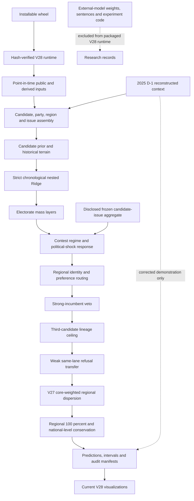

# V28 architecture

V28 is the active, frozen presidential model. It preserves V27 as a rollback and
removes neural inference, weights, source sentences, the direct stance overlay
and two automatic mega seeds from the packaged-runtime path. One frozen historical candidate-issue
aggregate remains as a disclosed postprocess input. The diagram below follows the
actual public entry points rather than older poster-era experiments.

The active package, frozen evidence, corrected demonstration and historical
research surfaces are enumerated in `REPOSITORY_BOUNDARIES.md`.

## Runtime chain

- Public historical pointer: `scripts/run_current_presidential_model.py`
- V28 wrapper: `scripts/run_active_presidential_model_v29.py`
- V26 shock ladder and event alignment: `scripts/run_active_presidential_model_v26.py`
- V25/V24 structural stack: `scripts/run_active_presidential_model_v25.py`
- Core engine: `presidential_issue_engine/issue_vote_engine.py`
- V27 terminal transform: `presidential_issue_engine/party_regionalism_dispersion.py`
- External-model-runtime-free boundary: `presidential_issue_engine/external_model_free_runtime.py`
- Public integrity audit: `scripts/audit_public_active_presidential_model_v29.py`
- Installed-runtime verifier: `src/election_forecast/v29_runtime.py`
- Wheel build boundary: `setup.py`

The version wrappers are intentionally layered. A successor must use a new
runner and output directory; it must not edit V28 or a rollback version in
place.

The public repository keeps historical research scripts for transparency, but
the wheel traces only modules reachable from the V28 historical/prospective,
audit, reproduction and visualization entry points. Optional external-model
experiments, raw caches and noncanonical research outputs are not admitted to
the packaged runtime.

## Preserved invariants

V28 retains V27's terminal regional transform but not byte-identical predictions.
It preserves each
candidate's vote-weighted national level and restores every election-region
composition to 100 percent. The public audit additionally pins the 232-row
panel, the V23-V27 rollback hashes, the V28 prediction hash, interval metadata,
and the fact that no 2025 row enters the scored historical artifact.

## Evidence boundaries

The 2002-2022 elections are a development panel. The 2025 path is a corrected
demonstration because its integration defects were repaired after the outcome
was known. Neither is an untouched prospective validation set.
