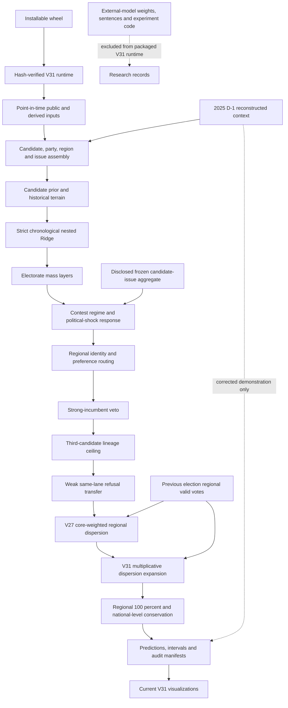

<!-- active-model-version: v31 -->
# V31 architecture

V31 is the active, frozen presidential model. It preserves V30 as a rollback,
keeps V28's external-model boundary unchanged — no neural inference, no weights,
no source sentences, no direct stance overlay, no automatic mega seeds in the
packaged-runtime path — and changes one thing: the terminal
dispersion expansion is multiplicative rather than additive, so no predicted
share can reach zero and the per-election feasibility cap is gone.
One frozen historical candidate-issue aggregate remains as a disclosed
postprocess input. The diagram below follows the actual
public entry points rather than older poster-era experiments.

The active package, frozen evidence, corrected demonstration and historical
research surfaces are enumerated in `REPOSITORY_BOUNDARIES.md`.

## Runtime chain

- Public historical pointer: `scripts/run_current_presidential_model.py`
- V31 wrapper: `scripts/run_active_presidential_model_v31.py`
- V28 external-model-free wrapper: `scripts/run_active_presidential_model_v28.py`
- V26 shock ladder and event alignment: `scripts/run_active_presidential_model_v26.py`
- V25/V24 structural stack: `scripts/run_active_presidential_model_v25.py`
- Core engine: `presidential_issue_engine/issue_vote_engine.py`
- V27 terminal transform: `presidential_issue_engine/party_regionalism_dispersion.py`
- V29 terminal transform: `presidential_issue_engine/third_share_dispersion_expansion.py`
- V30 forecast-time weights: `presidential_issue_engine/forecast_time_region_weights.py`
- V31 terminal transform: `presidential_issue_engine/multiplicative_dispersion_expansion.py`
- External-model-runtime-free boundary: `presidential_issue_engine/external_model_free_runtime.py`
- Public integrity audit: `scripts/audit_public_active_presidential_model_v31.py`
- Version-declaration audit: `scripts/audit_version_consistency.py`
- Installed-runtime verifier: `src/election_forecast/v31_runtime.py`
- Wheel build boundary: `setup.py`

The version wrappers are intentionally layered. A successor must use a new
runner and output directory; it must not edit V31 or a rollback version in
place.

The public repository keeps historical research scripts for transparency, but
the wheel traces only modules reachable from the V31 historical/prospective,
audit, reproduction and visualization entry points. Optional external-model
experiments, raw caches and noncanonical research outputs are not admitted to
the packaged runtime.

## What V30 changed

Both terminal transforms — V27's core-weighted dispersion and V29's third-share
expansion — work on each candidate's deviations around that candidate's own
vote-weighted national level. The weight locating that level was
`contest_votes`, the **target election's** regional turnout, which exists only
once the votes are counted. The 2025 prospective path already refused it and
substituted the previous election's volumes; the scored panel did not, so the
two paths weighted differently and the historical figures described something no
forecast could have produced.

Every scored election now weights by its predecessor's regional valid votes.
2002's predecessor is 1997, outside the scored panel, so its regional turnout
ships as `presidential_issue_engine/fixed_dataset/pres_1997_regional_turnout.csv`
— transcribed from 국사편찬위원회 한국사데이터베이스 and checked by summation
against the published national totals. A region absent from the predecessor
(세종 first appears in 2012) takes the predecessor's mean regional volume rather
than being dropped.

The leak was wide open and carried very little: 1997 and 2002 regional sizes
correlate at `0.996`, so the weight barely differed. Both headline figures
improved — regional macro `2.5736` → `2.5664`, national `0.7262` → `0.7204` —
which is recorded as an outcome, not as the justification. See
`EXPERIMENT_V30_FORECAST_TIME_WEIGHTS_20260824.md`.

## What V31 changes

V29's expansion is linear in each candidate's regional deviation, so it has no
lower bound, and it was capped per election at the largest factor admitting no
negative share. That cap is *defined* by the first region to reach zero, so the
region setting it is published at exactly zero whenever the cap binds — where
the arithmetic stopped, not an estimate. It bound twice: 홍준표's 광주 in 2017
(3.55% into the transform, 1.68% realised, 0.00% published) and 김문수's 광주 in
the 2025 demonstration (2.67% in, 0.00% out). Because each region is
renormalised to 100%, the displaced mass moved onto the other candidates there.

V31 expands the ratio instead of the difference:

    scaled = level * (pred / level) ** (1 + gain * predicted_third_share)

A positive input stays positive at any factor, so the constraint the cap
enforced holds by the form and the cap is removed rather than adjusted.

The multiplicative form preserves a geometric mean, not the arithmetic national
level, so levels drift by up to `0.465%p` on their own. The regional sums and
the candidate levels are therefore alternated to convergence, which restores the
level to `2.3e-13%p` and introduces no constant: the targets are the input
levels and one. Convergence takes 1–17 rounds and failure raises.

Regional macro `2.566445` → `2.500701`; national `0.720437` → `0.724291`. The
national figure is worse and the change was made anyway — a prediction of
exactly zero for a major-party candidate in a metropolitan region is wrong in
kind. See `EXPERIMENT_V31_MULTIPLICATIVE_EXPANSION_20260825.md`.

The artifact's `err_pp` and `abs_err_pp` columns now describe `layer_pred`, the
shipped prediction. They previously described `official_pred`, a pre-layer
baseline, which is carried on as `baseline_pre_layer_pred` with its own error
columns.

## What V29 added

Predicted regional spread matches the realised spread in 2002, 2012 and 2022 and
falls short of it in 2007 and 2017 — the two scored elections with a substantial
third candidate, and the only two where the slope of realised on predicted
exceeds 1. Each candidate's regional deviations are expanded around that
candidate's own vote-weighted national level by `1 + predicted_third_share`, and
each region is renormalised.

Three properties follow from the form rather than from tuning:

- **No outcome is read.** The index is the model's own predicted third-placed
  national level, available at forecast time.
- **The national level is conserved.** Candidate levels sum to one in every
  region, so a uniform expansion leaves each region summing to one and the
  renormalisation is a no-op. Measured, the largest candidate-level shift is
  `5.6e-15` percentage points.
- **It scopes itself.** The quantity that diagnoses the compression sizes the
  correction. 2012 has no third candidate, its factor is exactly `1.0000`, and
  it is untouched.

2017 and 2025 are feasibility-capped: their nominal factors would drive a
regional share below zero, so the expansion stops at the largest factor the
election admits. The cap is per election rather than per candidate, because
differing factors would break the regional sums and move the levels — the very
failure the cap exists to prevent.

The gain is not fitted. At exactly 1 the factor is the predicted third share
itself, so there is no constant for the scored panel to select; a swept gain of
0.50 scores better on the regional metric and is rejected for that reason. See
`EXPERIMENT_V29_THIRD_SHARE_DISPERSION_20260823.md`.

## Preserved invariants

V31 retains V27's terminal regional transform, V30's forecast-time weighting
and V28's external-model boundary, and replaces V29's additive expansion with a
multiplicative one that cannot emit a zero share. It
preserves each candidate's vote-weighted national level and restores every
election-region composition to 100 percent. The public audit additionally pins
the 232-row panel, the V23-V30 rollback hashes, the V31 prediction hash,
interval metadata, the absence of any negative share, and the fact that no 2025
row enters the scored historical artifact.

`scripts/audit_version_consistency.py` pins the declarations themselves: the
package version in four places, the CLI banner, a single packaged runtime
loader, the archive name, the frozen prediction hash in three places, the
GitHub baseline, the existence of every path the pointer names, and CI job names
not carrying a version.

## Evidence boundaries

The 2002-2022 elections are a development panel. The 2025 path is a corrected
demonstration because its integration defects were repaired after the outcome
was known. Neither is an untouched prospective validation set.

The 2025 demonstration is rebuilt from three published derived inputs standing
in for 154 MB the repository does not track; reproduction from the public tree
covers everything downstream of the Assembly keyword matching and takes that
matching as given. `PRES_2025_INPUT_GUIDE.md` states the boundary and the
procedure for recomputing it from the official proceedings.
