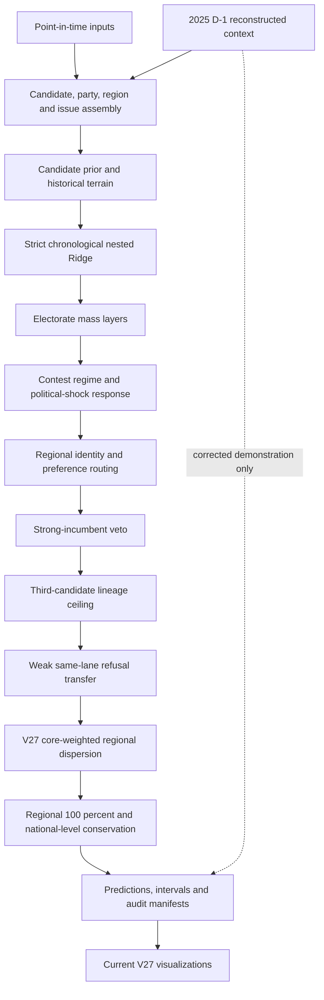

# V27 architecture

V27 is the active, frozen presidential model. The diagram below follows the
actual public entry points rather than older poster-era experiments.

## Runtime chain

- Public historical pointer: `scripts/run_current_presidential_model.py`
- V27 wrapper: `scripts/run_active_presidential_model_v27.py`
- V26 shock ladder and event alignment: `scripts/run_active_presidential_model_v26.py`
- V25/V24 structural stack: `scripts/run_active_presidential_model_v25.py`
- Core engine: `presidential_issue_engine/issue_vote_engine.py`
- V27 terminal transform: `presidential_issue_engine/party_regionalism_dispersion.py`
- Public integrity audit: `scripts/audit_public_active_presidential_model_v27.py`

The version wrappers are intentionally layered. A successor must use a new
runner and output directory; it must not edit V27 or a rollback version in
place.

## Preserved invariants

V27's terminal transform changes regional shape only. It preserves each
candidate's vote-weighted national level and restores every election-region
composition to 100 percent. The public audit additionally pins the 232-row
panel, the V23-V26 rollback hashes, the V27 prediction hash, interval metadata,
and the fact that no 2025 row enters the scored historical artifact.

## Evidence boundaries

The 2002-2022 elections are a development panel. The 2025 path is a corrected
demonstration because its integration defects were repaired after the outcome
was known. Neither is an untouched prospective validation set.

