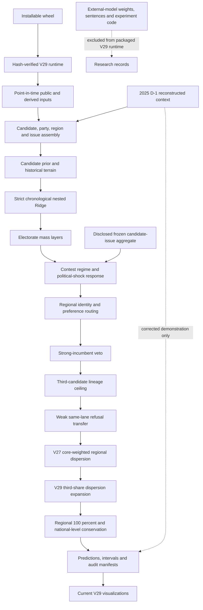

<!-- active-model-version: v29 -->
# V29 architecture

V29 is the active, frozen presidential model. It preserves V28 as a rollback,
keeps V28's external-model boundary unchanged — no neural inference, no weights,
no source sentences, no direct stance overlay, no automatic mega seeds in the
packaged-runtime path — and adds one transform: a third-share-indexed expansion
of the regional dispersion. One frozen historical candidate-issue aggregate
remains as a disclosed postprocess input. The diagram below follows the actual
public entry points rather than older poster-era experiments.

The active package, frozen evidence, corrected demonstration and historical
research surfaces are enumerated in `REPOSITORY_BOUNDARIES.md`.

## Runtime chain

- Public historical pointer: `scripts/run_current_presidential_model.py`
- V29 wrapper: `scripts/run_active_presidential_model_v29.py`
- V28 external-model-free wrapper: `scripts/run_active_presidential_model_v28.py`
- V26 shock ladder and event alignment: `scripts/run_active_presidential_model_v26.py`
- V25/V24 structural stack: `scripts/run_active_presidential_model_v25.py`
- Core engine: `presidential_issue_engine/issue_vote_engine.py`
- V27 terminal transform: `presidential_issue_engine/party_regionalism_dispersion.py`
- V29 terminal transform: `presidential_issue_engine/third_share_dispersion_expansion.py`
- External-model-runtime-free boundary: `presidential_issue_engine/external_model_free_runtime.py`
- Public integrity audit: `scripts/audit_public_active_presidential_model_v29.py`
- Version-declaration audit: `scripts/audit_version_consistency.py`
- Installed-runtime verifier: `src/election_forecast/v29_runtime.py`
- Wheel build boundary: `setup.py`

The version wrappers are intentionally layered. A successor must use a new
runner and output directory; it must not edit V29 or a rollback version in
place.

The public repository keeps historical research scripts for transparency, but
the wheel traces only modules reachable from the V29 historical/prospective,
audit, reproduction and visualization entry points. Optional external-model
experiments, raw caches and noncanonical research outputs are not admitted to
the packaged runtime.

## What V29 adds

Predicted regional spread matches the realised spread in 2002, 2012 and 2022 and
falls short of it in 2007 and 2017 — the two scored elections with a substantial
third candidate, and the only two where the slope of realised on predicted
exceeds 1. Each candidate's regional deviations are expanded around that
candidate's own vote-weighted national level by `1 + predicted_third_share`, and
each region is renormalised.

Three properties follow from the form rather than from tuning:

- **No outcome is read.** The index is the model's own predicted third-placed
  national level, available at forecast time.
- **The national level is conserved.** Candidate levels sum to one in every
  region, so a uniform expansion leaves each region summing to one and the
  renormalisation is a no-op. Measured, the largest candidate-level shift is
  `5.6e-15` percentage points.
- **It scopes itself.** The quantity that diagnoses the compression sizes the
  correction. 2012 has no third candidate, its factor is exactly `1.0000`, and
  it is untouched.

2017 and 2025 are feasibility-capped: their nominal factors would drive a
regional share below zero, so the expansion stops at the largest factor the
election admits. The cap is per election rather than per candidate, because
differing factors would break the regional sums and move the levels — the very
failure the cap exists to prevent.

The gain is not fitted. At exactly 1 the factor is the predicted third share
itself, so there is no constant for the scored panel to select; a swept gain of
0.50 scores better on the regional metric and is rejected for that reason. See
`EXPERIMENT_V29_THIRD_SHARE_DISPERSION_20260823.md`.

## Preserved invariants

V29 retains V27's terminal regional transform and V28's external-model boundary,
and adds its own terminal transform without byte-identical predictions. It
preserves each candidate's vote-weighted national level and restores every
election-region composition to 100 percent. The public audit additionally pins
the 232-row panel, the V23-V28 rollback hashes, the V29 prediction hash,
interval metadata, the absence of any negative share, and the fact that no 2025
row enters the scored historical artifact.

`scripts/audit_version_consistency.py` pins the declarations themselves: the
package version in four places, the CLI banner, a single packaged runtime
loader, the archive name, the frozen prediction hash in three places, the
GitHub baseline, the existence of every path the pointer names, and CI job names
not carrying a version.

## Evidence boundaries

The 2002-2022 elections are a development panel. The 2025 path is a corrected
demonstration because its integration defects were repaired after the outcome
was known. Neither is an untouched prospective validation set.

The 2025 demonstration is rebuilt from three published derived inputs standing
in for 154 MB the repository does not track; reproduction from the public tree
covers everything downstream of the Assembly keyword matching and takes that
matching as given. `PRES_2025_INPUT_GUIDE.md` states the boundary and the
procedure for recomputing it from the official proceedings.
